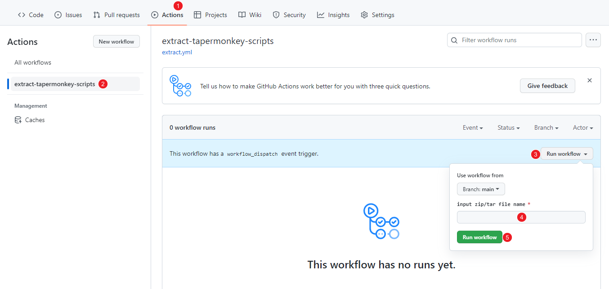
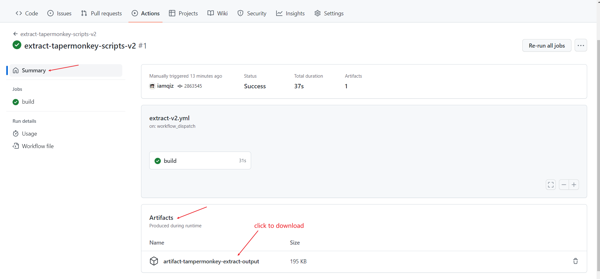

# 通过github action恢复油猴脚本
[English Doc](README.md)

本仓库可以从插件数据库(chrome leveldb格式)恢复油猴脚本,不需要在本地搭建环境,  
只需Fork本仓库,然后把油猴数据库压缩之后上传到github仓库,然后执行 github 动作,即可恢复脚本, 恢复之后下载下来即可


## 如何使用? how to use?


### 1 将油猴数据库打包成zip或者tar格式. | pack your tapermonkey database to .zip or .tar  
数据库的路径如下 :
```text
# Linux:  "/home/<USERNAME>/.config/<BROWSER>/Default/Local Extension Settings/<EXTENSION_ID>"
# Mac : "/Users/<USERNAME>/Library/Application Support/Google/Chrome/Default/Local Extension Settings/<EXTENSION_ID>/"
#Windows chrome: "C:\Users\<USERNAME>\AppData\Local\Google\Chrome\User Data\Default\Local Extension Settings\<EXTENSION_ID>"
#windows edge:   "C:\Users\<USERNAME>\AppData\Local\Microsoft\Edge\User Data\Default\Local Extension Settings\<EXTENSION_ID>
```
这里 EXTENSION_ID表示插件id, 通过"右键插件图标>管理拓展程序>ID"来获取
Local Extension Settings 位于浏览器个人资料目录(一般叫Default)下, chrome://version/ 页面下的"个人资料路径"即是个人资料目录路径

数据库目录下包括 Manifest-*      CURRENT     \*.ldb files 等文件  
例子:  


数据库格式为google leveldb,详细介绍见:  
[https://github.com/google/leveldb/blob/main/doc/impl.md](https://github.com/google/leveldb/blob/main/doc/impl.md)

### 2 fork 该仓库  
点击本仓库右上角Fork按钮复制仓库到自己账号下

### 3 将数据库目录打包成zip或tar,上传到上一步fork的仓库


### 4 运行github动作(actions),需要指定zip/tar压缩包的路径



等待动作执行完毕


### 5 下载处理结果artifact ,如下 




